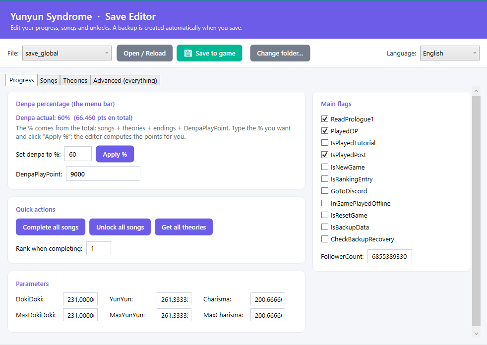

# Yunyun Syndrome · Save Editor

Un editor de guardados con interfaz gráfica para **Yunyun Syndrome**. Descifra los
archivos `save_global` y `save_slotN`, te deja editar tu progreso, canciones,
teorías y desbloqueos, y los vuelve a cifrar para que el juego los lea.

> ⚠️ **Aviso:** herramienta no oficial, sin relación con Alliance Arts. Edita tus
> propios guardados bajo tu responsabilidad. Haz copias de seguridad (la app crea
> una automáticamente en `backups/` cada vez que guardas).



## Características

- 🔓 Descifra/cifra los saves (AES‑256‑CBC) automáticamente.
- 🎚️ Pestaña **Progreso**: edita `DenpaPlayPoint` (la barra de denpa), parámetros y banderas.
- 🎵 Pestaña **Canciones**: tabla editable con las puntuaciones de cada canción.
- 🌳 Pestaña **Avanzado**: árbol con **todos** los campos del save; edita, añade y elimina cualquier valor.
- ⚡ Acciones rápidas: completar todas las canciones, desbloquear todas, conseguir todas las teorías.
- 💾 Copia de seguridad automática antes de cada guardado.
- 🌍 Multi-idioma: **Español, English, 日本語** (selector en vivo; recuerda tu elección).

## Uso

1. **Cierra el juego.**
2. En Steam, desactiva la nube de este juego mientras editas:
   *Biblioteca → clic derecho en Yunyun Syndrome → Propiedades → General →
   desmarca «Mantener las partidas guardadas en Steam Cloud»* (si no, la nube
   puede sobrescribir tus cambios).
3. Abre **`YunyunSaveEditor.exe`**.
4. Elige el archivo (`save_global` o un slot) y pulsa **Abrir / Recargar**.
5. Edita lo que quieras y pulsa **Guardar en el juego**.
6. Abre el juego y comprueba. ¿No es lo que querías? Repite.

La carpeta de guardados se detecta sola en:
`%USERPROFILE%\AppData\LocalLow\AllianceArts\Yunyun_Syndrome\player`
(si no, usa **Cambiar carpeta…**).

### Sobre el porcentaje de denpa
El % de denpa **no** sale solo de `DenpaPlayPoint`, sino del **total**:

```
total = DenpaPlayPoint + puntos de canciones + puntos de teorías + puntos de finales
```

(cada canción "perfecta" = 480 pts, cada final = 2.500 pts, las teorías según rareza).
El editor calcula tu total y tu % actual, y el botón **«Aplicar %»** pone el
`DenpaPlayPoint` exacto para alcanzar el % que pidas (teniendo en cuenta lo que ya
aportan canciones, teorías y finales). Puntos totales de referencia:

| %  | puntos | %   | puntos  |
|----|--------|-----|---------|
| 10 | 5.800  | 70  | 85.100  |
| 30 | 22.300 | 90  | 125.600 |
| 50 | 49.600 | 100 | 150.600 |

Los nombres reales de las canciones y la tabla de denpa se extrajeron de los datos
del propio juego (master data y tablas de localización).

## Descargar

Descarga `YunyunSaveEditor.exe` desde la sección **Releases**. Es un único
ejecutable autocontenido: no necesitas instalar .NET ni nada más (Windows x64).

## Compilar desde el código

Requiere el SDK de **.NET 9**.

```bash
dotnet build                       # compilación de desarrollo
# Ejecutable único autocontenido (no requiere .NET instalado):
dotnet publish -c Release -r win-x64 --self-contained true \
  -p:PublishSingleFile=true \
  -p:IncludeNativeLibrariesForSelfExtract=true \
  -p:EnableCompressionInSingleFile=true
# -> bin/Release/net9.0-windows/win-x64/publish/YunyunSaveEditor.exe
# (IncludeNativeLibrariesForSelfExtract es OBLIGATORIO en WPF single-file,
#  si no, falla con System.DllNotFoundException al arrancar.)
```

## Formato del guardado (notas técnicas)

- Cifrado: **AES‑256‑CBC + PKCS7**. El **IV son los primeros 16 bytes** del archivo;
  el resto es el texto cifrado. El contenido es **JSON UTF‑8** (sin BOM).
- `save_global`: colección y progreso (`DenpaPlayPoint`, `ScoreRecords`,
  `ConspiracyTheory`, `SongUnlockDatas`, `PictureUnlockDatas`, `EndingData`…).
- `save_slotN`: progreso de historia (`Episode`, `FlagData`, …).

## Traducciones / Idiomas

La interfaz está localizada (Español, English, 日本語). Cámbialo con el selector
de la esquina superior derecha; tu elección se guarda en `language.txt`.

**Añadir un idioma** (¡se agradecen PRs!): en [`Loc.cs`](Loc.cs)
1. Añade el código a `Loc.Available`, p. ej. `("fr", "Français")`.
2. Copia el diccionario `["en"] = new() { ... }` como `["fr"] = new() { ... }`
   y traduce los valores (deja las **claves** igual).

Todos los textos de la app salen de ahí, así que no hace falta tocar nada más.

## Licencia

MIT. Ver [LICENSE](LICENSE).
